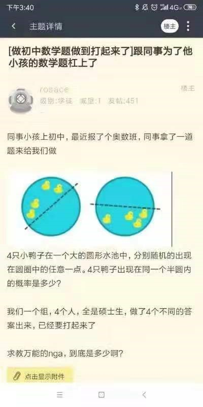

# 思路：

- 把二维问题转化为一维问题。针对任何一种鸭子分布，从圆心向每只鸭子连线，4条半径把一个周角切割成4个角。
定义其中超过180°的角为缺角，显然缺角或者不存在，或者存在一个。缺角存在的情形就是4只鸭子都在半圆内的情形。

- 把连续问题转化为离散问题，便于组合计数，然后再求极限。

- 在组合计数的时候，设每只鸭子是不同的。因为最后求的是概率，就是比例，所以这种设定不会有影响。
如果要考虑鸭子之间是无差别的，只是分子分母同时除以而已。

# 解：

把圆周分为n等份，每只鸭子的位置都是落在某一份里面。

4只鸭子分配到n个格子里面，总计数为〖A=n〗^4。

定义4只鸭子之间间隔最大并超过半圆的部分为缺角。

定义与缺角互补的部分为占角s。

显然s的特点是：其中分布了4只鸭子，且两边的格子都不空。

对于占角为s的情况，其计数为：

N(s)=(s^4-(s-1)^4-(s-1)^4+(s-2)^4)n=(12s^2-24s+14)n
- 第一项是4只鸭子在s个格子里分布的总计数。
- 第二项是最左边界的格子里没有鸭子的计数。
- 第三项是最右边界的格子里没有鸭子的计数。
- 第四项是两边格子里都没有鸭子的计数，因为前两项减重复了，所以加回来。
- 占角s可以出现在圆周的每个位置上，所以有n倍。

s的取值范围为0→n/2，在这个范围内对N(s)求和，即为所有符合“4只鸭子分布在一个半圆内”的总计数：

B=∑_(s=1)^(n/2)▒(12s^2-24s+14)n=12n∑_(s=1)^(n/2)▒s^2 -24n∑_(s=1)^(n/2)▒s+14n∑_(s=1)^(n/2)▒1
- 第一项可代入平方和公式进行计算。
- 为适应平方和公式，取s=1→n/2，对最终结果无影响。
- 后两项属于低阶，在后续求极限计算中会被忽略，故不必详细展开，简记为Δ。

故有：
B=12n ( n/2 (n/2+1)(2 n/2+1))/6+Δ=(n^2 (n+2)(n+1))/2+Δ

所以，当划分为n个格子时，所求概率为：
p(n)=B/A=((n^2 (n+2)(n+1))/2+Δ)/n^4 =(n^4+3n^3+2n^2+Δ)/(2n^4 )

所以原问题所求概率为：
P=lim┬(n→∞)⁡〖p(n)〗=lim┬(n→∞)⁡〖(n^4+3n^3+2n^2+Δ)/(2n^4 )〗=1/2

# 程序仿真模拟：

```javascript
var total = 1000000; // 重复实验次数
var cnt = 0; // 分布在一个半圆之内的次数
for (var i = 0; i < total; i++) {
	// 不失一般性，设第一只鸭子的位置为0
	// 随机产生另外3只鸭子的位置
	var a = [Math.random(), Math.random(), Math.random()];
	// 求出4个间隔
	a.sort();
	var b = [a[0] - 0.0, a[1] - a[0], a[2] - a[1], 1.0 - a[2]];
	// 考察最大的间隔是否超过一半
	b.sort();
	if (b[3] > 0.5) cnt ++;
}
console.log(cnt / total);
// 最后输出结果类似这样：0.499715 0.500318
```
